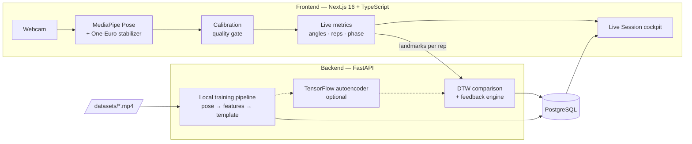

# AI Physio — Intelligent Physiotherapy & Rehabilitation Assistant

A camera-based rehabilitation platform that watches a patient perform an exercise,
scores every repetition against a therapist-approved reference movement, and gives
real-time posture correction — all with on-device pose estimation.

> **Not a medical device.** This is a movement-tracking aid for research and
> clinical prototyping. It does not diagnose, and it does not replace a licensed
> physiotherapist.

---

## What makes it different

| | |
|---|---|
| **Adaptive calibration gate** | Before tracking starts, the system scores the scene 0–100 (lighting, framing, full-body visibility, centering, camera roll, occlusion, stability). Analysis is **blocked** until quality passes, and **auto-pauses** if it degrades mid-session — so reps are never counted on garbage pose data. |
| **Learns from reference video** | Instead of hand-coded rules per exercise, the system learns the *correct movement* from curated clips and compares live motion to it with **Dynamic Time Warping**. |
| **Offline training pipeline** | A therapist drops clips into `datasets/<Exercise>/` and one command trains the whole library locally. No cloud, no uploads. |
| **Auto-segmentation** | Reference clips usually contain intros, talking and outros. The segmentation module detects the actual exercise window and trains only on that. |
| **Side-by-side reference player** | The learned reference clip plays next to the live camera, synced to the session, looping only the active movement. |
| **Privacy by design** | Video never leaves the machine — only derived pose landmarks are sent to the backend. |

---

## Architecture



**Two modes:** a *Dashboard* (analytics, reports, progress, exercise library, model
training) and a chrome-less *Live Session* cockpit that fits every rehab metric on
one 1920×1080 screen with no scrolling.

---

## Tech stack

**Frontend** — Next.js 16 (App Router), TypeScript, Tailwind CSS, MediaPipe Tasks Vision
**Backend** — FastAPI, SQLModel/SQLAlchemy, Pydantic, NumPy, OpenCV, MediaPipe, TensorFlow (optional)
**Database** — PostgreSQL (single source of truth — no localStorage anywhere)

---

## Getting started

### Prerequisites
- **Node.js 18+**
- **Python 3.11+** (3.11 recommended if you want the optional TensorFlow layer)
- **PostgreSQL 16/17** running locally

### 1. Database

```bash
cd backend
psql -U postgres -f db/init_postgres.sql   # creates the `physio` role + database
```

### 2. Backend

```bash
cd backend
python -m venv .venv
.venv\Scripts\activate          # Windows  (source .venv/bin/activate on macOS/Linux)
pip install -r requirements.txt
cp .env.example .env            # then set DATABASE_URL
uvicorn app.main:app --reload --port 8000
```

API docs: <http://localhost:8000/docs>

### 3. Frontend

```bash
cd frontend
npm install
echo NEXT_PUBLIC_API_URL=http://localhost:8000 > .env.local
npm run dev
```

Open <http://localhost:3000>. Grant camera permission, then **Start Session** —
the calibration gate will guide you into frame before tracking begins.

---

## Training the exercise library

Curate therapist-approved clips into per-exercise folders:

```
backend/datasets/
    ACL/            demo1.mp4  demo2.mp4
    Shoulder/       abduction.mp4
    Squat/          wall_squat.mp4
```

Then train locally (no network, no uploads):

```bash
cd backend
python scripts/train_local.py --datasets ./datasets            # everything
python scripts/train_local.py --exercise ACL --train-tf        # one + TF layer
```

The pipeline runs pose estimation, extracts biomechanical features, trims the
non-exercise footage, builds the DTW template, stores a reference clip, and saves
it all to PostgreSQL. Trained exercises light up in the UI automatically.

See [`backend/datasets/README.md`](backend/datasets/README.md) for details.

---

## Project structure

```
backend/
  app/
    routers/     exercises · videos · analysis · sessions · progress · reports
    services/    biomechanics · segmentation · reference · dtw · comparison
                 feedback · reps · pose · mlmodel · recommend
    models.py    RehabSession · JointMeasurement · ExerciseFeedback · ...
  scripts/train_local.py     offline training CLI
  tests/                     DTW core + segmentation unit tests
frontend/
  app/(dashboard)/           dashboard · exercises · progress · reports · settings
  app/(session)/live-session live cockpit (full-viewport, no scroll)
  components/session/        CameraStage · CalibrationOverlay · ReferenceMiniPlayer
  hooks/                     usePoseDetection · useLiveMetrics · useRepCounter ...
  lib/                       calibration · liveMetrics · oneEuroFilter · api
```

---

## Key API endpoints

| Method | Path | Purpose |
|---|---|---|
| `GET` | `/exercises` | library + per-exercise training status |
| `POST` | `/exercises/{id}/train` | learn from reference videos |
| `GET` | `/exercises/{id}/reference-video` | clip + active window for the player |
| `POST` | `/analyze/rep` | score one repetition against the template |
| `POST` `GET` `DELETE` | `/sessions` | session records (paginated, filterable) |
| `GET` | `/progress` · `/reports` | analytics and per-session summaries |

---

## Tests

```bash
cd backend
python -m tests.test_core          # DTW template + rep scoring
python -m tests.test_segmentation  # active-exercise detection
```

Both run on synthetic data — no camera, GPU, or MediaPipe required.

---

## Current limitations

- Single-patient: `patient_id` defaults to `"default"`; there is no auth yet.
- *Stability*, *balance* and *calorie* figures are derived heuristics, not clinical measurements.
- Camera pitch/yaw and distance are estimated from body proportions, not true intrinsics.
- Without a trained profile an exercise still works, but feedback falls back to rule-based cues.
